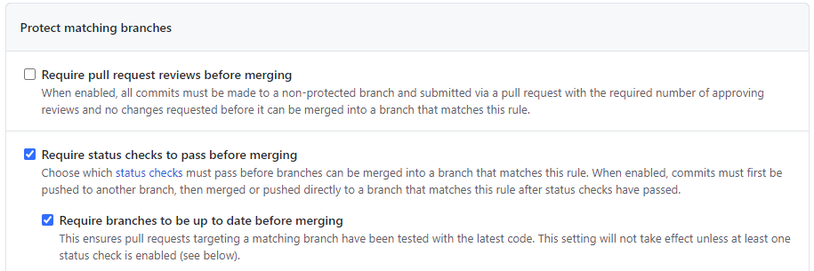
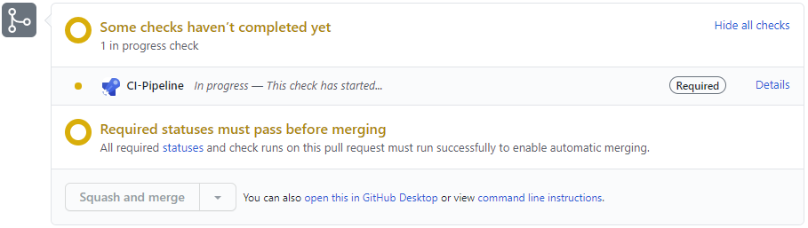

# Continuous Integration with Git / GitHub

> **Continuous Integration** is the practice of merging all developers' working copies to a shared mainline several times a day.

*Fowler, Martin (1 May 2006). "[Continuous Integration](https://martinfowler.com/articles/continuousIntegration.html)". Retrieved 9 January 2014.*

## Implementing CI with Git 

The default Git settings only perform merge conflict checks.

If a branch has an associated pipeline trigger, or an associated pull request pipeline trigger, Git integrates the code into the branch **before** invoking any triggers on the branch.

Code can be pushed or PR merged to a branch even if it contains defects, fails to build or compile in the pipeline, or fails to pass unit tests or any other checks.

This can result in breaking, untested code getting pushed in to the shared mainline. This can then subsequently result in developers pushing further broken code on top of code that is already broken.

Not good. 

## Git Branch Protection Rules

Git branch protection rules can help ensure only *working* or releasable code is pushed to the shared mainline.

There are two settings to consider that are described in more detail below:

- Require status checks to pass before merging branches
- Require branches to be up to date before merging branches

Screenshot:

### Require Status Checks To Pass

The 'require status checks to pass' setting can be used to protect the shared mainline branch and only allow code to be merged in from branches containing working code (where the status checks have already passed).

> **Pull Requests**
>
> Status checks require pull requests and prevent commits being directly pushed to the protected branch. Practices that can reduce the additional overhead of pull requests are discussed later in this article.

The status checks will prevent pull requests being completed on the protected branch untill all the required checks have passed. The PR merge or complete buttons are greyed out and disabled in the UI until the checks have passed.

Screenshot:

If the branch has associated Azure pipelines, the pipelines must be completed successfully to pass the check.

> The word 'pass' could be misleading because it refers to the Git status check, not the outcome of the Azure pipeline. Automated tests are not required in the pipeline, as long as the pipeline completes successfully (without failure) the pipeline will 'pass' the Git status check. However if the pipeline does include automated tests, any failing tests should cause a failed pipeline status and subsequently fail the Git status check.  

> **Include Administrators**
> 
> Ensure the 'Include administrators' setting is also enabled otherwise pull requests created by Git repo administrators will be automatically merged without running any checks (the checks are ignored and skipped). If left disabled Git repo administrators will also be able to directly push changes to the protected branch. (Of course if you have awesome repo admins that will NEVER introduce breaking changes you could leave the 'Include administrators' setting disabled.) 

### Require branches to be up to date before merging

The "Require branches to be up to date before merging" setting will ensure merges are up to date (zero commits behind) the target branch. This can help false positives checking a branch that is out of date. 

---
To be reviewed...

## Pull Request practices

### Automatic PR Completion

- automatic default (squash) merge and branch delete.

### Additional Notes

> Pair programming and mob programming techniques could be evaluated with continuous integration practices, where the continuous integration of two developers' code occurs in the converstation *before* the code is actually written. Further debate of pair and mob programming is outside the scope of this article. For the purpose of this article it is assumed that some level of branch protection will benefit the team. 

