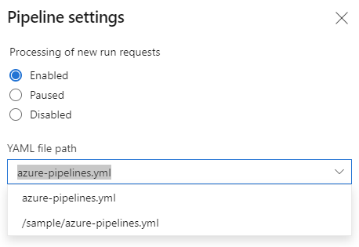

# Azure DevOps Pipeline Sample 

This repo was created to explore Azure Pipelines and CI/CD patterns.
 
Create a new Azure DevOps pipeline and select a new empty GitHub repo. 

Azure DevOps adds a sample `\azure-pipelines.yml` file to the repo root and names the new pipeline `{$GitHubAccountName}.{$RepoName}` in the Azure DevOps web portal.

```
trigger:
- main

pool:
  vmImage: 'ubuntu-latest'

steps:
- script: echo Hello, world!
  displayName: 'Run a one-line script'

- script: |
    echo Add other tasks to build, test, and deploy your project.
    echo See https://aka.ms/yaml
  displayName: 'Run a multi-line script'
  ```

The sample pipeline will be triggered on any push or merge to the `main` branch. Changes to other branches do not trigger the pipeline but the pipeline can be run manually for any branch using the Azure DevOps web portal.

> Note: All pull requests **for all branches** will also trigger the pipeline unless a `-pr` section is added to the .yml file with an include/exclude pattern. When a branch is included in a PR all push commits to that branch will trigger the pipeline until the PR is complete.

### Moving the pipeline.yml file to a different directory

Azure DevOps creates the sample `\azure-pipelines.yml` file in the repo root directory. 

 If the .yml file is moved or removed in subsequent commits, the associated Azure DevOps pipeline will no longer work because it cannot find the .yml file at the original file path.

```
An error occurred while fetching the YAML file 'azure-pipelines.yml' in the repository's default branch and latest build branches: main. Error on last attempt: File azure-pipelines.yml not found in repository mikejonestechno/Azure at version/branch main.
```

To resolve this go to the Azure DevOps pipeline settings and update the YAML file path associated with the pipeline.


